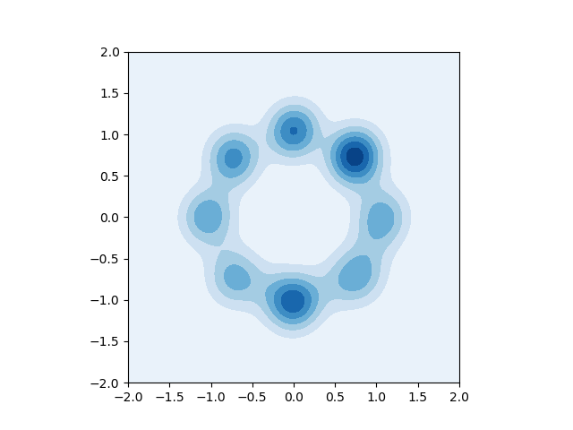
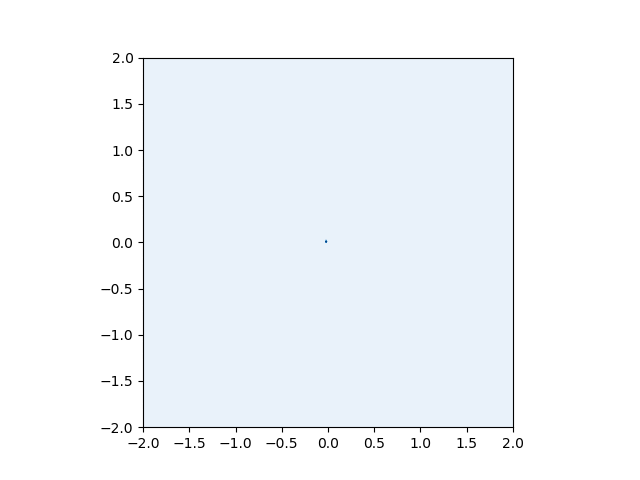
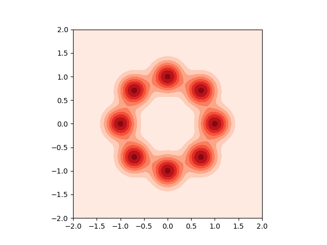

# Consensus Optimization 

Consensus Optimization is an idea from https://arxiv.org/abs/1705.10461, where the paper aims to , so that it has better convergence properties through the analyzed of "smooth 2-players games".

So, this might have an application on the multi-agent reinfocement learning training. This code is written in pyTorch and inspired by https://gist.github.com/LMescheder/b4d57e094cc8522497fdb5cf8fb44676

## Original GAN Implementation 
At first, I tried to reproduce the result from the paper using mixture of Gaussians as a toy task in the original paper. 

This is the result. 

This is the evolution of the GAN while training

Where this is the original distribution

