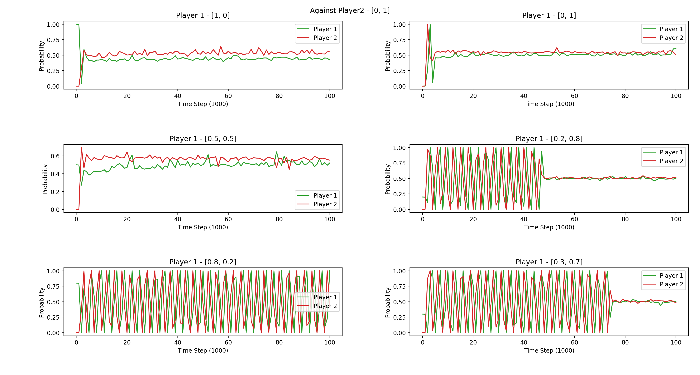

# Win-or-Learn-Fast
Implementation for the paper "Multiagent Learning Using a Variable Learning Rate"

## Result

### Matching Pennies
We test the performance of agent by making it play against itself, but with difference initialization of the initial policy.

#### Against [0, 1] for 100,000 iterations  
Some converges to an optimal policy.  

| Player 1 init Policy | Final Policy (player1/player2)|
| ------------- | ------------- |
| (1.0, 0.0) |(0.4650000000000004, 0.5349999999999996) (0.5930030090069373, 0.40699699099306275)|
| (0.0, 1.0) |(0.5099999999999996, 0.49000000000000044) (0.5390000000000005, 0.4609999999999995)|
| (0.5, 0.5) |(0.505, 0.495) (0.5860010030039995, 0.4139989969960005)|
| (0.2, 0.8) |(0.4922938633542938, 0.5077061366457062) (0.5089999999999996, 0.49100000000000044)|
| (0.8, 0.2) |(0.18331535524490944, 0.8166846447550906) (0.0, 1.0)|
| (0.3, 0.7) |(0.5064423489303821, 0.4935576510696179) (0.49000000000000044, 0.5099999999999996)|

### Prisoner's Dilemma
Same setting as the matching pennies. Action at position 0 means defect, and at position 1 means cooperate.

#### Against [0, 1] for 100,000 iterations
All the test cases are the same, and all converges to Nash Equilibrium(all defect).

