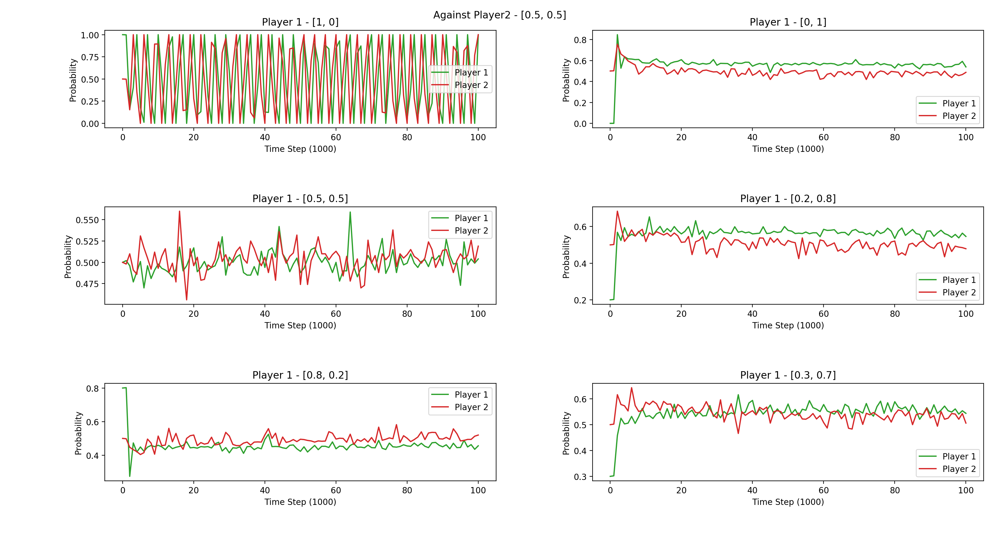

# Win-or-Learn-Fast
Implementation for the paper "Multiagent Learning Using a Variable Learning Rate"

## Result

### Matching Pennies
We test the performance of agent by making it play against itself, but with difference initialization of the initial policy.

The gradient field of this game is 

#### Against [0, 1] for 100,000 iterations  
Some converges to an optimal policy.  
Hyperparameter - alpha = 0.5, lr_w, lr_l = 0.001, 0.002

| Player 1 init Policy | Final Policy (player1/player2)|
| ------------- | ------------- |
| (1.0, 0.0) |(0.4650000000000004, 0.5349999999999996) (0.5930030090069373, 0.40699699099306275)|
| (0.0, 1.0) |(0.5099999999999996, 0.49000000000000044) (0.5390000000000005, 0.4609999999999995)|
| (0.5, 0.5) |(0.505, 0.495) (0.5860010030039995, 0.4139989969960005)|
| (0.2, 0.8) |(0.4922938633542938, 0.5077061366457062) (0.5089999999999996, 0.49100000000000044)|
| (0.8, 0.2) |(0.18331535524490944, 0.8166846447550906) (0.0, 1.0)|
| (0.3, 0.7) |(0.5064423489303821, 0.4935576510696179) (0.49000000000000044, 0.5099999999999996)|

With Decayed Learning Rate and alpha as described in the paper (500,000 iterations)

| Player 1 init Policy | Final Policy (player1/player2)|
| ------------- | ------------- |
| (1.0, 0.0) | (0.5048907730937217, 0.4951092269062784), (0.5172694245497066, 0.4827305754502934) |
| (0.0, 1.0) | (0.5014053601134144, 0.49859463988658564), (0.49270243995885876, 0.5072975600411413) |
| (0.5, 0.5) | (0.5143130500936758, 0.48568694990632433), (0.49929750546259344, 0.5007024945374067) |
| (0.2, 0.8) | (0.40886136163029807, 0.591138638369702), (0.0, 1.0) |
| (0.8, 0.2) | (0.4994951615250192, 0.5005048384749808), (0.5088305830391315, 0.4911694169608684) |
| (0.3, 0.7) | (0.5543023883581103, 0.44569761164188976), (0.4521255110063833, 0.5478744889936168) |

Looking the evolution of the players (plotted with 200000 iterations)

#### Against [0.5, 0.5] for 100,000 iterations
For some experiment, the policy converges, some aren't.
Hyperparameter - alpha = 0.5, lr_w, lr_l = 0.001, 0.002

Converged Policy

| Player 1 init Policy | Final Policy (player1/player2)|
| ------------- | ------------- |
| (1.0, 0.0) | (0.4109999999999995, 0.5890000000000005), (0.5420000000000005, 0.4579999999999995) |
| (0.0, 1.0) | (0.5600000000000005, 0.4399999999999995), (0.4289999999999995, 0.5710000000000005) |
| (0.5, 0.5) | (0.561, 0.43899999999999995), (0.517, 0.483) |
| (0.2, 0.8) | (0.5572031872509963, 0.44279681274900373), (0.51799203187251, 0.48200796812749) |
| (0.8, 0.2) | (0.44179681274900373, 0.5582031872509963), (0.53599203187251, 0.46400796812749) |
| (0.3, 0.7) | (0.5680000000000003, 0.4319999999999997), (0.484, 0.516) |

Non-Converged Policy

| Player 1 init Policy | Final Policy (player1/player2)|
| ------------- | ------------- |
| (1.0, 0.0) | (0.5731610251757697, 0.4268389748242303), (0.0, 1.0) |
| (0.0, 1.0) | (0.5660000000000005, 0.4339999999999995), (0.49699999999999955, 0.5030000000000004) |
| (0.5, 0.5) | (0.518, 0.482), (0.489, 0.511) |
| (0.2, 0.8) | (0.5750000000000003, 0.4249999999999997), (0.484, 0.516) |
| (0.8, 0.2) | (0.46299999999999975, 0.5370000000000003), (0.519, 0.481) |
| (0.3, 0.7) | (0.5647888446215142, 0.43521115537848576), (0.53599203187251, 0.46400796812749) |

With Decayed Learning Rate and alpha as described in the paper

| Player 1 init Policy | Final Policy (player1/player2)|
| ------------- | ------------- |
| (1.0, 0.0) | (0.4365635434979726, 0.5634364565020274), (0.45505350903555614, 0.5449464909644439) |
| (0.0, 1.0) | (0.4499537137638966, 0.5500462862361034), (0.4905829948359524, 0.5094170051640476) |
| (0.5, 0.5) | (0.4989164143082269, 0.5010835856917731), (0.49214832024193117, 0.5078516797580689) |
| (0.2, 0.8) | (0.5124668170515285, 0.48753318294847153), (0.4925182706221096, 0.5074817293778904) |
| (0.8, 0.2) | (0.4742120190045302, 0.5257879809954699), (0.48429595716191093, 0.5157040428380891) |
| (0.3, 0.7) | (0.511557823263268, 0.488442176736732), (0.5026784760307389, 0.49732152396926116) |

Looking the evolution of the players (plotted with 200000 iterations)

### Prisoner's Dilemma
Same setting as the matching pennies. Action at position 0 means defect, and at position 1 means cooperate.

#### Against [0, 1] for 100,000 iterations
All the test cases are the same, and all converges to Nash Equilibrium(all defect).
Hyperparameter - alpha = 0.5, lr_w, lr_l = 0.001, 0.002

#### Against [0.5, 0.5] for 100,000 iterations
All the test cases are the same, and all converges to Nash Equilibrium(all defect).
Hyperparameter - alpha = 0.5, lr_w, lr_l = 0.001, 0.002

### Iterated Prisoner's Dilemma
Hyperparameter - alpha = 0.8, gamma = 0.99, lr_w, lr_l = 0.001, 0.002

Run for 300,000
The algorithm somewhat implement tit-for-tat strategy (although the start policy should be both cooperative).

(prob of defect, prob of coop)

| Last State (player1/player2) | Final Policy (player1/player2) |
| ---------------------------- | ------------------------------ |
| Start | (1.0, 0.0) (1.0, 0.0) |
| Defect/Defect | (1.0, 0.0) (1.0, 0.0) |
| Defect/Coop | (0.742, 0.258) (0.958, 0.042) |
| Coop/Defect | (0.9, 0.1) (1.0, 0.0) |
| Coop/Coop | (0.646, 0.354) (0.654, 0.346) |

With the decayed learning rate with 300000 iterations

| Last State (player1/player2) | Final Policy (player1/player2) |
| ---------------------------- | ------------------------------ |
| Start | (1.0, 0.0) (1.0, 0.0) |
| Defect/Defect | (1.0, 0.0) (1.0, 0.0) |
| Defect/Coop | (1.0, 0.0) (0.9477544789363, 0.05224552106369995) |
| Coop/Defect | (0.959322957194368, 0.04067704280563206) (0.9966128969149801, 0.003387103085019939) |
| Coop/Coop | (0.6145160653040006, 0.38548393469599934) (0.6366347399222625, 0.3633652600777376) |
